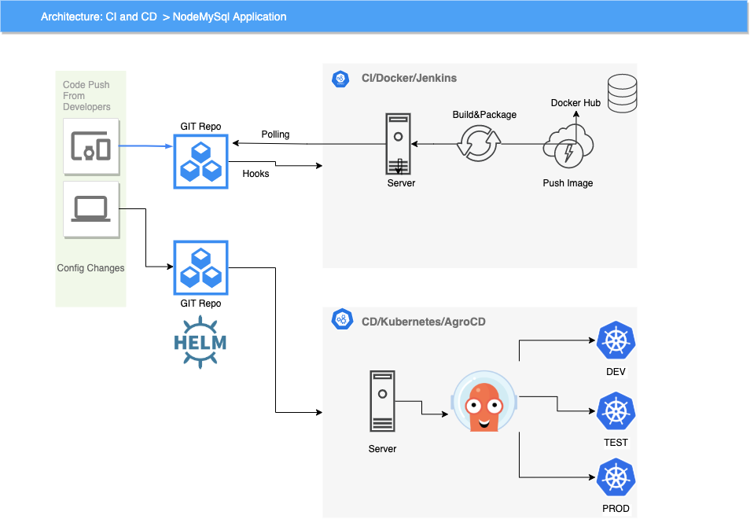
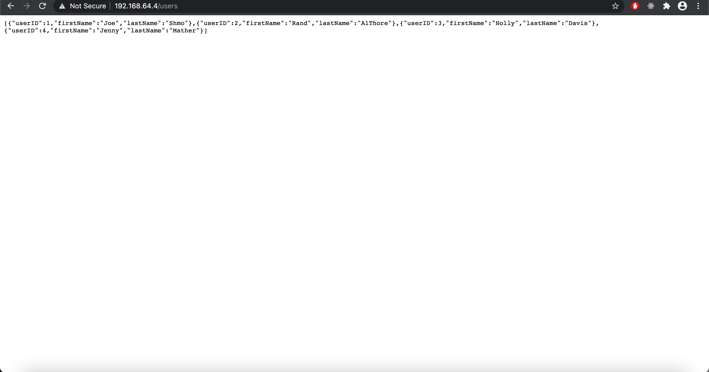
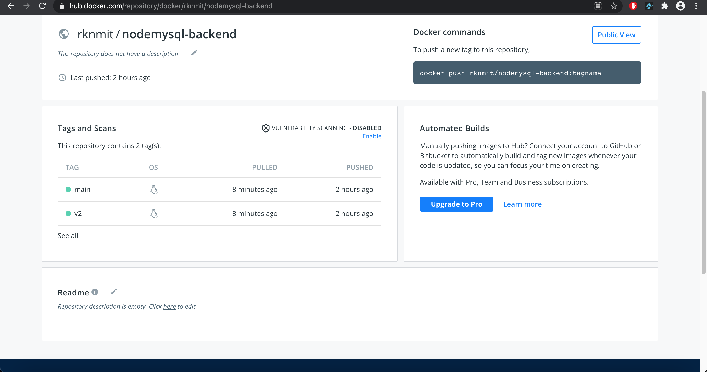
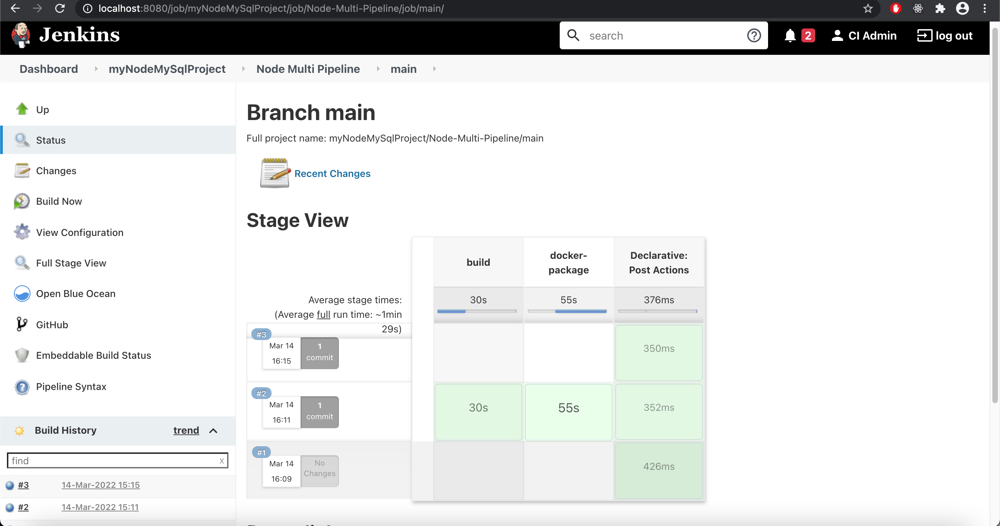
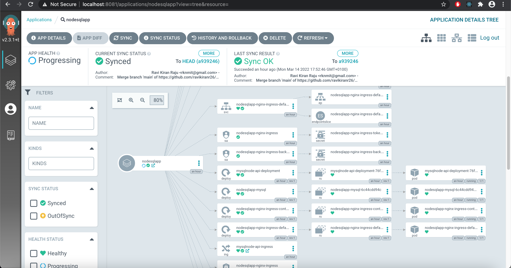

## Node MySql App with helm charts for deploying

** Architecture

** Node App
npm i
npm start

** MySql DB
we will use the mysql to deploy via dependencies

** CI
we will use Jenkins and declartive file to generate the pipeline and publish the image

** CD
we will use AgroCD to deploy the application on local minikube

** TODO
use sonar cube with qualitiy gets
